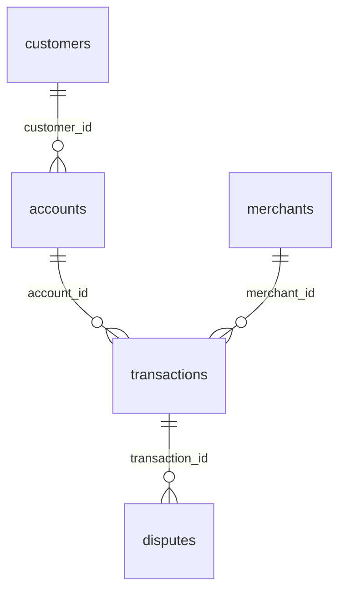
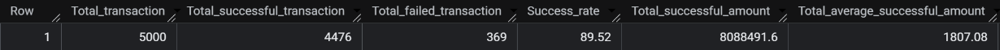
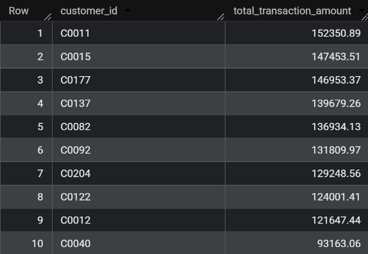
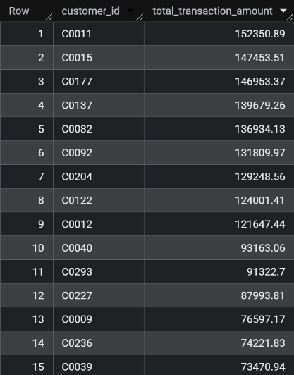
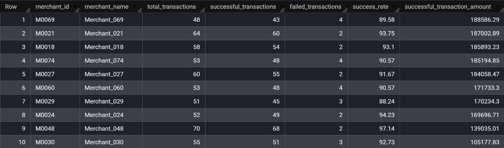
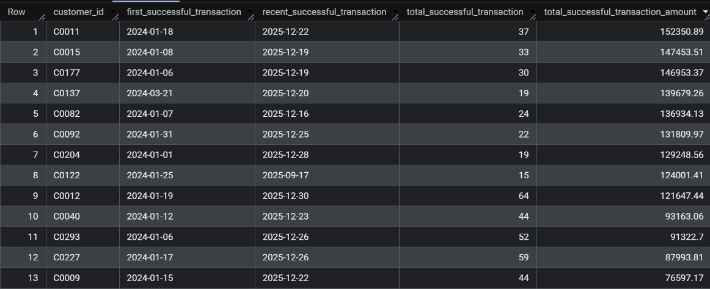
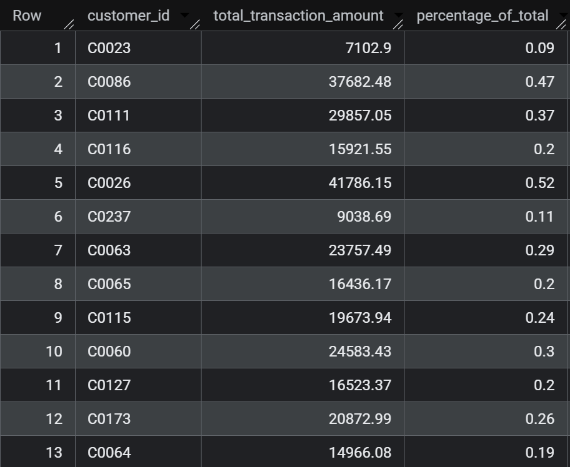

# FinTech SQL Analytics Project

## Business scenario

You are a Data Analyst at a digital payments/FinTech company.

The company processes customer payments through UPI, cards, wallets, net banking, and ATMs. Management is concerned about:

Transaction performance
Customer behavior
Revenue/transaction volume
Failed transactions
Fraud and disputes
Merchant performance
Customer segments
High-risk activity

Your job is to analyze the company's transactional data using SQL only and provide actionable business insights.

## Dataset

| Table          |  Rows | Purpose                          |
| -------------- | ----: | -------------------------------- |
| `customers`    |   300 | Customer information             |
| `accounts`     |   450 | Customer bank/wallet accounts    |
| `merchants`    |   101 | Merchant information             |
| `transactions` | 5,000 | Payment transactions             |
| `disputes`     |   350 | Transaction disputes/chargebacks |

## Table relationships

## Business problems that we will be answering

### Phase 1 — Core Business Analysis

#### Q1. Overall Transaction Performance

> Calculate: Total transactions, Successful transactions, Failed transactions, Success rate, Total successful transaction amount and Average successful transaction amount

Query:

    SELECT
    (SELECT COUNT(*) FROM fintechproject.transactions) AS Total_transaction,
    (SELECT COUNTIF(status = "Success") FROM fintechproject.transactions) AS Total_successful_transaction,
    (SELECT COUNTIF(status = "Failed") FROM fintechproject.transactions) AS Total_failed_transaction,
    (SELECT ROUND(COUNTIF(status = "Success") * 100.0 / COUNT(*),2) FROM fintechproject.transactions) as Success_rate,
    (SELECT ROUND(SUM(amount),2) FROM fintechproject.transactions where status = "Success") as Total_successful_amount,
    (SELECT ROUND(AVG(amount),2) FROM fintechproject.transactions where status = "Success") as Total_average_successful_amount

Analysis:

    The company processed 5,000 transactions, of which 4,476 succeeded (89.52%), 369 failed, and 155 remained pending. Successful payments generated ₹80.88 lakh at an average ticket of ₹1,807. Nearly 1 in 10 attempts does not complete, so failure and pending handling is a material operations issue, not a rounding error. Stabilising the last ~10% of attempts (especially converting pendings) would lift completed volume without needing more traffic.

#### Q2. Monthly Transaction Performance

> For each month, calculate: Total successful transactions, Total successful transaction amount, Average transaction amount and Month-over-month transaction growth %

Query:

    WITH Transaction_Details AS (
    SELECT
        DATE_TRUNC(DATE(transaction_timestamp), MONTH) AS Month,
        COUNT(*) AS Total_Transactions,
        ROUND(SUM(amount),2) as Total_Sum_Amount,
        ROUND(AVG(amount),2) as Total_Avg_Amount,
    FROM fintechproject.transactions
    WHERE status = "Success"
    GROUP BY DATE_TRUNC(DATE(transaction_timestamp), MONTH)
    ORDER BY Month
    )
    SELECT
        Month,
        Total_Transactions,
        Total_Avg_Amount,
        Total_Sum_Amount,
        LAG(Total_Sum_Amount) OVER(ORDER BY Month) AS Previous_Month_Amount,
        ROUND(
            (Total_Sum_Amount - LAG(Total_Sum_Amount) OVER(ORDER BY Month)) / NULLIF(LAG(Total_Sum_Amount) OVER(ORDER BY Month) , 0) * 100
            ,2) AS MoM_Percent_Growth
    FROM Transaction_Details

Analysis:

    Successful volume is lumpy rather than steadily growing. In the months shown, value swung from a −37% drop in Feb 2024 to a +97% spike in Sep 2024 (driven by a much higher average ticket of ₹3,205, not more transactions), then crashed −49% in Oct 2024. Count stays in a narrow band (~155–217), so the business problem is ticket-size volatility, not customer activity collapsing. Treat September-style spikes as one-off high-value activity unless they repeat; otherwise forecasting and working-capital planning will overfit those months.

#### Q3. Top Customers

> Find the top 10 customers by total successful transaction amount. Return: customer_id, total_transaction_amount

Query:

    SELECT
        c.customer_id,
        ROUND(SUM(amount),2) AS total_transaction_amount
    FROM fintechproject.customers c 
    JOIN fintechproject.accounts a 
        ON c.customer_id = a.customer_id
    JOIN fintechproject.transactions t
        ON a.account_id = t.account_id
    WHERE t.status = "Success"
    GROUP BY c.customer_id
    ORDER BY total_transaction_amount DESC
    LIMIT 10

Analysis:

    The top 10 successful spenders range from ₹1.52 lakh (C0011) down to ₹0.93 lakh (C0040). The first nine sit in a tight ₹1.22–1.52 lakh band; C040 is a clear step down. Together these ten customers are about 16% of successful value — useful whales, but not so concentrated that losing one would break the book. They are the natural pool for relationship coverage, fee discounts, and higher fraud monitoring because a single account failure here moves more GMV than dozens of average users.

#### Q4. Customers Above Average

> Find customers whose total successful transaction amount is greater than the average customer transaction amount. Return: customer_id, total_transaction_amount

Query:

    WITH Customer_Transaction_Details AS (
        SELECT
            c.customer_id,
            ROUND(SUM(amount),2) AS total_transaction_amount
        FROM fintechproject.customers c 
            JOIN fintechproject.accounts a 
                ON c.customer_id = a.customer_id
            JOIN fintechproject.transactions t
                ON a.account_id = t.account_id
        WHERE t.status = "Success" 
        GROUP BY c.customer_id
    )
    SELECT 
        customer_id,
        total_transaction_amount
    FROM Customer_Transaction_Details
    WHERE total_transaction_amount > (
        SELECT AVG(total_transaction_amount) FROM Customer_Transaction_Details
    )
    ORDER BY total_transaction_amount DESC

Analysis:

    Only 231 of 300 customers have at least one successful payment. Among those, the average successful lifetime value is about ₹35,015, and 92 customers (40%) sit above that mean — a right-skewed book, not a 50/50 split. The above-average list starts with the same whales as Q3 and continues through mid-tier names (C0293, C0227, C0009, etc.). This cohort is the realistic growth/retention target: large enough to matter, still far from “everyone.” Marketing and limit increases should be aimed here rather than at the full 300-customer file.

#### Q5. Customer Ranking by City

> Rank customers by successful transaction amount within each city. Return: city, customer_id, total_transaction_amount and customer_rank

Query:

    SELECT
        c.city,
        c.customer_id,
        ROUND(SUM(amount),2) AS total_transaction_amount,
        DENSE_RANK() OVER(PARTITION BY c.city ORDER BY SUM(amount) DESC) AS customer_rank
    FROM fintechproject.customers c 
    JOIN fintechproject.accounts a 
        ON c.customer_id = a.customer_id
    JOIN fintechproject.transactions t
        ON a.account_id = t.account_id
    WHERE t.status = "Success" 
    GROUP BY c.city, c.customer_id
    ORDER BY city, customer_rank

Analysis:

    City-level ranks show local “number ones,” not a single national leader. In Ahmedabad (screenshot), C0015 at ₹1.47 lakh is more than double the #2 customer (₹0.72 lakh) — a city book that is top-heavy. Across all eight cities the local leaders are: Chennai C0011 (₹1.52L), Ahmedabad C0015 (₹1.47L), Kolkata C0177 (₹1.47L), Hyderabad C0082 (₹1.37L), Bengaluru C0122 (₹1.24L), Mumbai C0040 (₹0.93L), Delhi C0293 (₹0.91L), Pune C0227 (₹0.88L). City campaigns should treat Ahmedabad/Chennai/Kolkata as whale-led markets and Delhi/Pune/Mumbai as more even books where mid-tier customers matter more.

### Phase 2 — Merchant & Payment Analysis

#### Q6. Payment Channel Performance

> For each payment channel calculate: Total transactions, Successful transactions, Failed transactions, Success rate, Total successful transaction amount and Average successful transaction amount. Then identify the best and worst performing channel.

Query:
    
    SELECT
        payment_channel,
        COUNT(*) AS total_transactions,
        COUNTIF(status = 'Success') AS successful_transactions,
        COUNTIF(status = 'Failed') AS failed_transactions,
        ROUND(SUM(amount), 2) AS successful_transaction_amount,
        ROUND(COUNTIF(status = 'Success') * 100.0 / COUNT(*), 2) AS success_rate,
        ROUND(SUM(CASE WHEN status = 'Success' THEN amount ELSE 0 END), 2) AS successful_transaction_amount,
        ROUND(avg(CASE WHEN status = 'Success' THEN amount END), 2) AS average_successful_transaction_amount
    FROM fintechproject.transactions
    GROUP BY payment_channel
    ORDER BY success_rate DESC

Analysis:

    **Best channel: ATM** on success rate (90.64%). **Worst: Wallet** (87.40%), with Net Banking close behind (88.89%). Volume tells a different story: UPI is the franchise — 2,224 attempts and ₹33.87 lakh successful value (~42% of successful GMV) at a solid 90.06% success. Card is #2 by value (₹21.95 lakh) but only 89.56% success. Net Banking has the highest average successful ticket (₹2,105) and Card next (₹1,924), so those rails matter for high-value payments even if they fail more. Priority: keep UPI reliability high (it is the volume engine); fix Wallet failures first (worst rate, still 484 attempts); investigate Net Banking drop-offs on large tickets.

#### Q7. Merchant Performance

> For each merchant calculate: Total transactions, Successful transactions, Failed transactions, Success rate and Total successful transaction amount . Then find the top 10 merchants by transaction value.

Query:

    SELECT
        m.merchant_id,
        m.merchant_name,
        COUNT(*) AS total_transactions,
        COUNTIF(status = 'Success') AS successful_transactions,
        COUNTIF(status = 'Failed') AS failed_transactions,
        ROUND(COUNTIF(status = 'Success') * 100.0 / COUNT(*), 2) AS success_rate,
        ROUND(SUM(CASE WHEN status = 'Success' THEN amount ELSE 0 END), 2) AS successful_transaction_amount
    FROM fintechproject.transactions t
        JOIN fintechproject.merchants m 
            ON t.merchant_id = m.merchant_id
    GROUP BY m.merchant_id, m.merchant_name
    ORDER BY successful_transaction_amount DESC
    LIMIT 10

Analysis:

    The top 10 merchants by successful value are a tight cluster around ₹1.05–1.89 lakh. Merchant_069 leads on value (₹1.89 lakh) but only at 89.58% success with 4 failures — high GMV with a weak reliability signal. Merchant_048 is the quality outlier: 97.14% success on 70 transactions, though value is lower (₹1.39 lakh). Merchant_029 (88.24% success) also sits in the top 10 by value. Commercial ranking by GMV alone would miss reliability risk; partnership reviews should score **value × success rate**, and Merchant_069 / Merchant_029 need ops follow-up despite being “top merchants.”

#### Q8. High-Risk Merchants

> Identify merchants that have: At least 50 transactions, Success rate below 90% and Dispute rate above the overall merchant dispute rate
Return the merchant and relevant metrics. This is one of the strongest questions in the project because it combines multiple datasets and business conditions.

Query:

    WITH overall_dispute_rate AS  (
        SELECT COUNT(d.transaction_id) * 100.0 / COUNT(t.transaction_id) AS overall_dispute_rate
        FROM fintechproject.transactions t
        LEFT JOIN fintechproject.disputes d
            ON t.transaction_id = d.transaction_id
    )
    SELECT 
        m.merchant_id,
        m.merchant_name,
        count(t.transaction_id) as total_transactions,
        count(d.transaction_id) as dispute_transactions,
        ROUND(COUNTIF(status = 'Success') * 100.0 / COUNT(*),2) AS success_rate,
        ROUND(count(d.transaction_id) * 100.0 / count(t.transaction_id),2) AS dispute_rate
    FROM fintechproject.transactions t
        JOIN fintechproject.merchants m 
            ON t.merchant_id = m.merchant_id
        LEFT JOIN fintechproject.disputes d
            ON d.transaction_id = t.transaction_id 
    GROUP BY m.merchant_id, m.merchant_name
    HAVING COUNT(t.transaction_id) >= 50
        AND 
            COUNTIF(status = 'Success') * 100.0 / COUNT(*) < 90.0
        AND 
            count(d.transaction_id) * 100.0 / count(t.transaction_id) > (SELECT * FROM overall_dispute_rate)

Analysis:

    Thirteen merchants clear all three risk gates (≥50 transactions, success rate <90%, dispute rate above the network ~7%). Worst combination is Merchant_087: 82.14% success and 14.29% disputes (8 of 56). Merchant_008 is similar (13.46% disputes). Merchant_015 and Merchant_036 fail more than they dispute (success in the low 82–83% range). These are not small noisy shops — each has 50–65 transactions — so the pattern is structural. Immediate actions: tighter monitoring or hold on M0087/M0008, payment-flow review on M0015/M0036, and a shared SLA that success must stay ≥90% and disputes at or below the 7% network baseline.

### Phase 3 — Customer & Risk Analysis

#### Q9. Customer Transaction History

> For every customer with at least one successful transaction, find: First successful transaction date, Most recent successful transaction date, Total successful transactions and Total successful transaction amount.

Query:

    SELECT
    c.customer_id,
        MIN(DATE(transaction_timestamp)) AS first_successful_transaction,
        MAX(DATE(transaction_timestamp)) AS recent_successful_transaction,
        COUNT(t.transaction_id) AS total_successful_transaction,
        ROUND(SUM(amount),2) AS total_successful_transaction_amount
    FROM fintechproject.customers c 
        JOIN fintechproject.accounts a 
            ON c.customer_id = a.customer_id
        JOIN fintechproject.transactions t
            ON a.account_id = t.account_id
    WHERE t.status = 'Success'
    GROUP BY c.customer_id
    ORDER BY total_successful_transaction_amount DESC

Analysis:

    High-value customers are mostly long-tenured, not one-shot spenders. C0011 through C0092 typically started in Jan–Mar 2024 and were still transacting in Dec 2025. Frequency and value are not the same thing: C0012 made 64 successful payments (highest in the top list) for ₹1.22 lakh, while C0137 reached ₹1.40 lakh in only 19 payments — a high-ticket, lower-frequency profile. C0122’s last success is Sep 2025 while peers are still active in December — a churn-risk flag on an otherwise top-10 account. Retention should split “frequent small/medium tickets” (C0012, C0293, C0227) from “few large tickets” (C0137, C0122) instead of one CRM playbook.

#### Q10. Customer Contribution

> Calculate what percentage of the company's total successful transaction value is generated by each customer. Return: customer_id, total_transaction_amount and percentage_of_total. The percentages should total approximately 100%.

Query:

    WITH customer_transaction_total AS (
    SELECT
        c.customer_id, 
        ROUND(SUM(amount),2) AS total_transaction_amount
    FROM fintechproject.customers c 
        JOIN fintechproject.accounts a 
            ON c.customer_id = a.customer_id
        JOIN fintechproject.transactions t
            ON a.account_id = t.account_id
    WHERE t.status = 'Success'
    GROUP BY c.customer_id
    )
    SELECT
        customer_id,
        total_transaction_amount,
        ROUND(total_transaction_amount * 100.0 /sum(total_transaction_amount) OVER(),2) as percentage_of_total
    FROM customer_transaction_total

Analysis:

    No single customer dominates the P&L. The largest, C0011, is only ~1.88% of successful value; the top 10 together are ~16%. The screenshot rows (unordered) show typical customers at 0.1–0.5% each, which is consistent with a long tail. That is healthy diversification: the book does not collapse if one whale leaves, but it also means growth must come from many accounts (the 92 above-average customers from Q4), not from one VIP program. Percentages across all customers with successful volume will sum to 100% of the ₹80.88 lakh successful total.