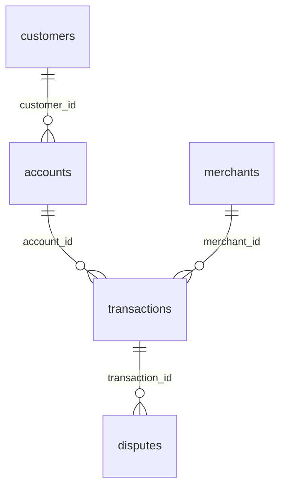

# FinTech SQL Analytics Project

## Business scenario

You are a Data Analyst at a digital payments/FinTech company.

The company processes customer payments through UPI, cards, wallets, net banking, and ATMs. Management is concerned about:

Transaction performance
Customer behavior
Revenue/transaction volume
Failed transactions
Fraud and disputes
Merchant performance
Customer segments
High-risk activity

Your job is to analyze the company's transactional data using SQL only and provide actionable business insights.

## Dataset

| Table          |  Rows | Purpose                          |
| -------------- | ----: | -------------------------------- |
| `customers`    |   300 | Customer information             |
| `accounts`     |   450 | Customer bank/wallet accounts    |
| `merchants`    |   101 | Merchant information             |
| `transactions` | 5,000 | Payment transactions             |
| `disputes`     |   350 | Transaction disputes/chargebacks |

## Table relationships

## Business problems that we will be answering

### Phase 1 — Core Business Analysis

#### Q1. Overall Transaction Performance

Calculate:
Total transactions
Successful transactions
Failed transactions
Success rate
Total successful transaction amount
Average successful transaction amount

#### Q2. Monthly Transaction Performance

For each month, calculate:
Total successful transactions
Total successful transaction amount
Average transaction amount
Month-over-month transaction growth %

#### Q3. Top Customers

Find the top 10 customers by total successful transaction amount.
Return: customer_id, total_transaction_amount

#### Q4. Customers Above Average

Find customers whose total successful transaction amount is greater than the average customer transaction amount.

Return:customer_id, total_transaction_amount

#### Q5. Customer Ranking by City

Rank customers by successful transaction amount within each city.
Return: city, customer_id, total_transaction_amount and customer_rank

### Phase 2 — Merchant & Payment Analysis

#### Q6. Payment Channel Performance

For each payment channel calculate:
Total transactions
Successful transactions
Failed transactions
Success rate
Total successful transaction amount
Average successful transaction amount

Then identify the best and worst performing channel.

#### Q7. Merchant Performance

For each merchant calculate:
Total transactions
Successful transactions
Failed transactions
Success rate
Total successful transaction amount

Then find the top 10 merchants by transaction value.

#### Q8. High-Risk Merchants

Identify merchants that have:
At least 50 transactions
Success rate below 90%
Dispute rate above the overall merchant dispute rate

Return the merchant and relevant metrics.

This is one of the strongest questions in the project because it combines multiple datasets and business conditions.

### Phase 3 — Customer & Risk Analysis

#### Q9. Customer Transaction History

For every customer with at least one successful transaction, find:

First successful transaction date
Most recent successful transaction date
Total successful transactions
Total successful transaction amount

#### Q10. Customer Contribution

Calculate what percentage of the company's total successful transaction value is generated by each customer.
Return: customer_id, total_transaction_amount and percentage_of_total

The percentages should total approximately 100%.

#### Q11. Customer Segmentation

Create customer segments based on total successful transaction amount:
< ₹50,000       → Low Value
₹50,000–₹2L     → Medium Value
> ₹2L            → High Value

Calculate for each segment:

Number of customers
Total transaction value
Percentage of total transaction value
Average transaction value

SQL skills: CTE + CASE + aggregation.

#### Q12. Repeated Failed Transactions

Find customers who have experienced 5 or more failed transactions.

Return:

customer_id
failed_transaction_count
failed_transaction_amount

Then identify which customer has the highest failed transaction amount.

### Phase 4 — Advanced SQL & Business Insights

#### Q13. Suspicious Transaction Pattern

Identify customers who had at least 3 failed transactions within a 24-hour period.

Return:

customer_id
first_failed_transaction
last_failed_transaction
failed_transaction_count

SQL skills: Window functions / date-time analysis.

#### Q14. Transaction Concentration

Determine how dependent the company is on its biggest customers.

Calculate the percentage of total successful transaction value generated by:

Top 10 customers
Top 20 customers
Top 50 customers

Answer:

"Does a small group of customers contribute a disproportionate amount of the company's transaction value?"

#### Q15. Executive Business Analysis

Using the results from Q1–Q14, provide 5 data-driven recommendations for the company's management.

Your recommendations should cover areas such as:

Payment channel performance
Customer value
Merchant risk
Transaction failures
Suspicious activity

Every recommendation must be supported by an actual finding from your SQL analysis.