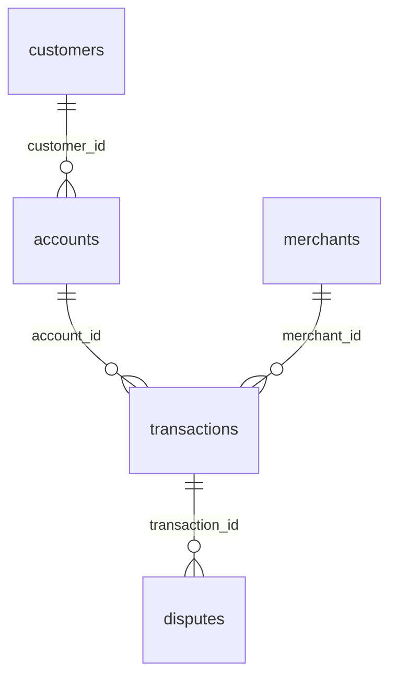
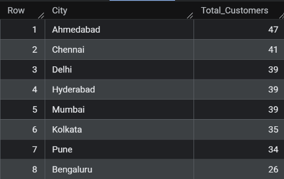

# FinTech SQL Analytics Project

## Business scenario

You are a Data Analyst at a digital payments/FinTech company.

The company processes customer payments through UPI, cards, wallets, net banking, and ATMs. Management is concerned about:

Transaction performance
Customer behavior
Revenue/transaction volume
Failed transactions
Fraud and disputes
Merchant performance
Customer segments
High-risk activity

Your job is to analyze the company's transactional data using SQL only and provide actionable business insights.

## Dataset

| Table          |  Rows | Purpose                          |
| -------------- | ----: | -------------------------------- |
| `customers`    |   300 | Customer information             |
| `accounts`     |   450 | Customer bank/wallet accounts    |
| `merchants`    |   100 | Merchant information             |
| `transactions` | 5,000 | Payment transactions             |
| `disputes`     |   350 | Transaction disputes/chargebacks |

## Table relationships

## Business problems you need to solve

Don't immediately start writing random SQL queries.

Your job is to answer these business questions.

### Phase 1 — Data Exploration

#### Q1 How many customers, accounts, merchants and transactions does the company have?

Query : 

SELECT
  (SELECT COUNT(\*) FROM fintechproject.accounts) as Total_Accounts,
  (SELECT COUNT(\*) FROM fintechproject.customers) as Total_Customers,
  (SELECT COUNT(\*) FROM fintechproject.merchants) as Total_Merchants, 
  (SELECT COUNT(\*) FROM fintechproject.transactions) as Total_Transactions

Analysis: The company has total of 450 accounts, 300 customers, 101 merchants and 5000 transactions.

#### Q2 How many customers are in each city?

Query : 

SELECT City, COUNT(\*) AS Total_Customers
FROM fintechproject.customers
GROUP BY city
ORDER BY COUNT(*) DESC

Analysis: We can deduce, the top three cities with highest customer base is Ahmedabad, Chennai and Delhi with total of 47, 41 and 39 customers respectively. Among all the cities Benguluru has the lowest custmer base as just 26 customers.

#### Q3 What percentage of customers have: Verified KYC, Pending KYC and Rejected KYC?

#### Q4 How many accounts are: Active, Dormant, Closed?

#### Q5 What are the different transaction types and how frequently does each occur?
