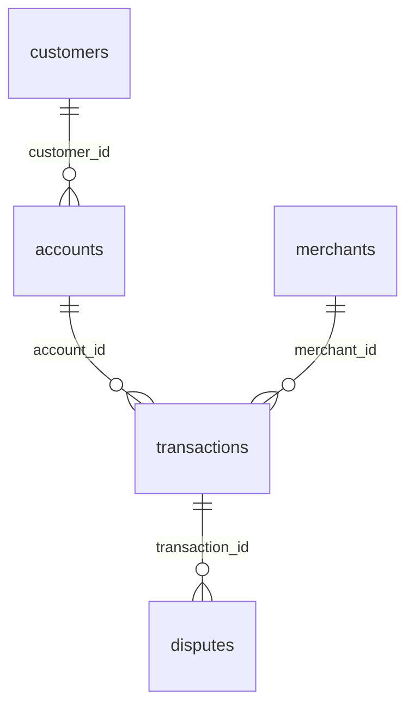
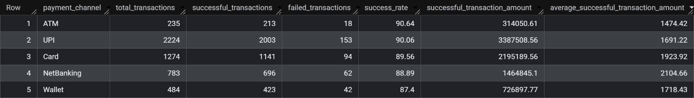
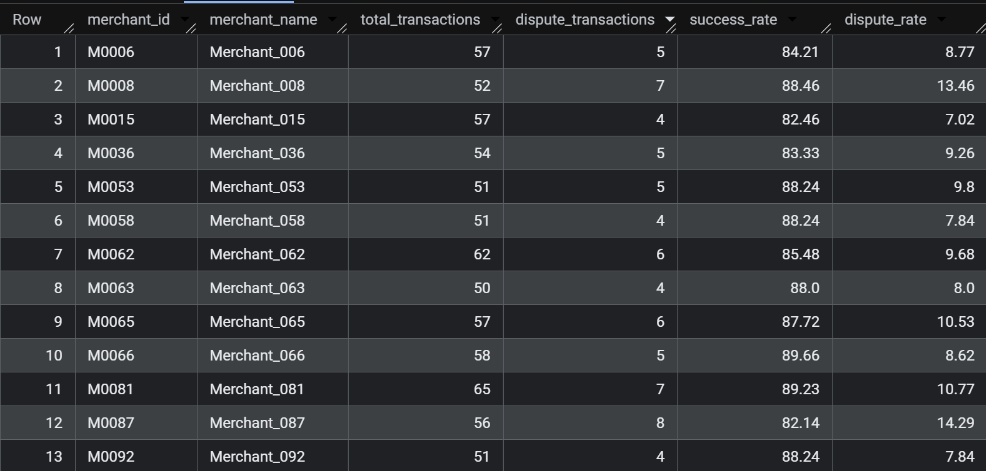

# FinTech SQL Analytics Project

## Business scenario

You are a Data Analyst at a digital payments/FinTech company.

The company processes customer payments through UPI, cards, wallets, net banking, and ATMs. Management is concerned about:

Transaction performance
Customer behavior
Revenue/transaction volume
Failed transactions
Fraud and disputes
Merchant performance
Customer segments
High-risk activity

Your job is to analyze the company's transactional data using SQL only and provide actionable business insights.

## Dataset

| Table          |  Rows | Purpose                          |
| -------------- | ----: | -------------------------------- |
| `customers`    |   300 | Customer information             |
| `accounts`     |   450 | Customer bank/wallet accounts    |
| `merchants`    |   101 | Merchant information             |
| `transactions` | 5,000 | Payment transactions             |
| `disputes`     |   350 | Transaction disputes/chargebacks |

## Table relationships

## Business problems that we will be answering

### Phase 1 — Core Business Analysis

#### Q1. Overall Transaction Performance

Calculate: Total transactions, Successful transactions, Failed transactions, Success rate, Total successful transaction amount and Average successful transaction amount

Query:

    SELECT
    (SELECT COUNT(*) FROM fintechproject.transactions) AS Total_transaction,
    (SELECT COUNTIF(status = "Success") FROM fintechproject.transactions) AS Total_successful_transaction,
    (SELECT COUNTIF(status = "Failed") FROM fintechproject.transactions) AS Total_failed_transaction,
    (SELECT ROUND(COUNTIF(status = "Success") * 100.0 / COUNT(*),2) FROM fintechproject.transactions) as Success_rate,
    (SELECT ROUND(SUM(amount),2) FROM fintechproject.transactions where status = "Success") as Total_successful_amount,
    (SELECT ROUND(AVG(amount),2) FROM fintechproject.transactions where status = "Success") as Total_average_successful_amount

Analysis: 

#### Q2. Monthly Transaction Performance

For each month, calculate: Total successful transactions, Total successful transaction amount, Average transaction amount and Month-over-month transaction growth %

Query:

    WITH Transaction_Details AS (
    SELECT
        DATE_TRUNC(DATE(transaction_timestamp), MONTH) AS Month,
        COUNT(*) AS Total_Transactions,
        ROUND(SUM(amount),2) as Total_Sum_Amount,
        ROUND(AVG(amount),2) as Total_Avg_Amount,
    FROM fintechproject.transactions
    WHERE status = "Success"
    GROUP BY DATE_TRUNC(DATE(transaction_timestamp), MONTH)
    ORDER BY Month
    )
    SELECT
        Month,
        Total_Transactions,
        Total_Avg_Amount,
        Total_Sum_Amount,
        LAG(Total_Sum_Amount) OVER(ORDER BY Month) AS Previous_Month_Amount,
        ROUND(
            (Total_Sum_Amount - LAG(Total_Sum_Amount) OVER(ORDER BY Month)) / NULLIF(LAG(Total_Sum_Amount) OVER(ORDER BY Month) , 0) * 100
            ,2) AS MoM_Percent_Growth
    FROM Transaction_Details

Analysis: 

#### Q3. Top Customers

Find the top 10 customers by total successful transaction amount. Return: customer_id, total_transaction_amount

Query:

    SELECT
        c.customer_id,
        ROUND(SUM(amount),2) AS total_transaction_amount
    FROM fintechproject.customers c 
    JOIN fintechproject.accounts a 
        ON c.customer_id = a.customer_id
    JOIN fintechproject.transactions t
        ON a.account_id = t.account_id
    WHERE t.status = "Success"
    GROUP BY c.customer_id
    ORDER BY total_transaction_amount DESC
    LIMIT 10

Analysis: 

#### Q4. Customers Above Average

Find customers whose total successful transaction amount is greater than the average customer transaction amount. Return: customer_id, total_transaction_amount

Query:

    WITH Customer_Transaction_Details AS (
        SELECT
            c.customer_id,
            ROUND(SUM(amount),2) AS total_transaction_amount
        FROM fintechproject.customers c 
            JOIN fintechproject.accounts a 
                ON c.customer_id = a.customer_id
            JOIN fintechproject.transactions t
                ON a.account_id = t.account_id
        WHERE t.status = "Success" 
        GROUP BY c.customer_id
    )
    SELECT 
        customer_id,
        total_transaction_amount
    FROM Customer_Transaction_Details
    WHERE total_transaction_amount > (
        SELECT AVG(total_transaction_amount) FROM Customer_Transaction_Details
    )
    ORDER BY total_transaction_amount DESC

Analysis:

#### Q5. Customer Ranking by City

Rank customers by successful transaction amount within each city.
Return: city, customer_id, total_transaction_amount and customer_rank

Query:

    SELECT
        c.city,
        c.customer_id,
        ROUND(SUM(amount),2) AS total_transaction_amount,
        DENSE_RANK() OVER(PARTITION BY c.city ORDER BY SUM(amount) DESC) AS customer_rank
    FROM fintechproject.customers c 
    JOIN fintechproject.accounts a 
        ON c.customer_id = a.customer_id
    JOIN fintechproject.transactions t
        ON a.account_id = t.account_id
    WHERE t.status = "Success" 
    GROUP BY c.city, c.customer_id
    ORDER BY city, customer_rank

### Phase 2 — Merchant & Payment Analysis

#### Q6. Payment Channel Performance

For each payment channel calculate: Total transactions, Successful transactions, Failed transactions, Success rate, Total successful transaction amount and Average successful transaction amount. 
Then identify the best and worst performing channel.

Query:
    
    SELECT
        payment_channel,
        COUNT(*) AS total_transactions,
        COUNTIF(status = 'Success') AS successful_transactions,
        COUNTIF(status = 'Failed') AS failed_transactions,
        ROUND(SUM(amount), 2) AS successful_transaction_amount,
        ROUND(COUNTIF(status = 'Success') * 100.0 / COUNT(*), 2) AS success_rate,
        ROUND(SUM(CASE WHEN status = 'Success' THEN amount ELSE 0 END), 2) AS successful_transaction_amount,
        ROUND(avg(CASE WHEN status = 'Success' THEN amount END), 2) AS average_successful_transaction_amount
    FROM fintechproject.transactions
    GROUP BY payment_channel
    ORDER BY success_rate DESC

Analysis:

#### Q7. Merchant Performance

For each merchant calculate: Total transactions, Successful transactions, Failed transactions, Success rate and Total successful transaction amount . Then find the top 10 merchants by transaction value.

Query:

    SELECT
        m.merchant_id,
        m.merchant_name,
        COUNT(*) AS total_transactions,
        COUNTIF(status = 'Success') AS successful_transactions,
        COUNTIF(status = 'Failed') AS failed_transactions,
        ROUND(COUNTIF(status = 'Success') * 100.0 / COUNT(*), 2) AS success_rate,
        ROUND(SUM(CASE WHEN status = 'Success' THEN amount ELSE 0 END), 2) AS successful_transaction_amount
    FROM fintechproject.transactions t
        JOIN fintechproject.merchants m 
            ON t.merchant_id = m.merchant_id
    GROUP BY m.merchant_id, m.merchant_name
    ORDER BY successful_transaction_amount DESC
    LIMIT 10

Analysis:

#### Q8. High-Risk Merchants

Identify merchants that have: At least 50 transactions, Success rate below 90% and Dispute rate above the overall merchant dispute rate
Return the merchant and relevant metrics. This is one of the strongest questions in the project because it combines multiple datasets and business conditions.

Query:

    WITH overall_dispute_rate AS  (
        SELECT COUNT(d.transaction_id) * 100.0 / COUNT(t.transaction_id) AS overall_dispute_rate
        FROM fintechproject.transactions t
        LEFT JOIN fintechproject.disputes d
            ON t.transaction_id = d.transaction_id
    )
    SELECT 
        m.merchant_id,
        m.merchant_name,
        count(t.transaction_id) as total_transactions,
        count(d.transaction_id) as dispute_transactions,
        ROUND(COUNTIF(status = 'Success') * 100.0 / COUNT(*),2) AS success_rate,
        ROUND(count(d.transaction_id) * 100.0 / count(t.transaction_id),2) AS dispute_rate
    FROM fintechproject.transactions t
        JOIN fintechproject.merchants m 
            ON t.merchant_id = m.merchant_id
        LEFT JOIN fintechproject.disputes d
            ON d.transaction_id = t.transaction_id 
    GROUP BY m.merchant_id, m.merchant_name
    HAVING COUNT(t.transaction_id) >= 50
        AND 
            COUNTIF(status = 'Success') * 100.0 / COUNT(*) < 90.0
        AND 
            count(d.transaction_id) * 100.0 / count(t.transaction_id) > (SELECT * FROM overall_dispute_rate)

### Phase 3 — Customer & Risk Analysis

#### Q9. Customer Transaction History

For every customer with at least one successful transaction, find:

First successful transaction date
Most recent successful transaction date
Total successful transactions
Total successful transaction amount

#### Q10. Customer Contribution

Calculate what percentage of the company's total successful transaction value is generated by each customer.
Return: customer_id, total_transaction_amount and percentage_of_total

The percentages should total approximately 100%.

#### Q11. Customer Segmentation

Create customer segments based on total successful transaction amount:
< ₹50,000       → Low Value
₹50,000–₹2L     → Medium Value
> ₹2L            → High Value

Calculate for each segment:

Number of customers
Total transaction value
Percentage of total transaction value
Average transaction value

SQL skills: CTE + CASE + aggregation.

#### Q12. Repeated Failed Transactions

Find customers who have experienced 5 or more failed transactions.

Return:

customer_id
failed_transaction_count
failed_transaction_amount

Then identify which customer has the highest failed transaction amount.

### Phase 4 — Advanced SQL & Business Insights

#### Q13. Suspicious Transaction Pattern

Identify customers who had at least 3 failed transactions within a 24-hour period.

Return:

customer_id
first_failed_transaction
last_failed_transaction
failed_transaction_count

SQL skills: Window functions / date-time analysis.

#### Q14. Transaction Concentration

Determine how dependent the company is on its biggest customers.

Calculate the percentage of total successful transaction value generated by:

Top 10 customers
Top 20 customers
Top 50 customers

Answer:

"Does a small group of customers contribute a disproportionate amount of the company's transaction value?"

#### Q15. Executive Business Analysis

Using the results from Q1–Q14, provide 5 data-driven recommendations for the company's management.

Your recommendations should cover areas such as:

Payment channel performance
Customer value
Merchant risk
Transaction failures
Suspicious activity

Every recommendation must be supported by an actual finding from your SQL analysis.