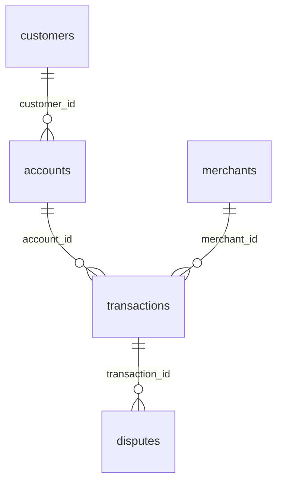
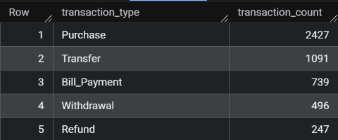

# FinTech SQL Analytics Project

## Business scenario

You are a Data Analyst at a digital payments/FinTech company.

The company processes customer payments through UPI, cards, wallets, net banking, and ATMs. Management is concerned about:

Transaction performance
Customer behavior
Revenue/transaction volume
Failed transactions
Fraud and disputes
Merchant performance
Customer segments
High-risk activity

Your job is to analyze the company's transactional data using SQL only and provide actionable business insights.

## Dataset

| Table          |  Rows | Purpose                          |
| -------------- | ----: | -------------------------------- |
| `customers`    |   300 | Customer information             |
| `accounts`     |   450 | Customer bank/wallet accounts    |
| `merchants`    |   101 | Merchant information             |
| `transactions` | 5,000 | Payment transactions             |
| `disputes`     |   350 | Transaction disputes/chargebacks |

## Table relationships

## Business problems that we will be answering

### Phase 1 — Data Exploration

#### Q1 How many customers, accounts, merchants and transactions does the company have?

Query : 

SELECT
  (SELECT COUNT(\*) FROM fintechproject.accounts) as Total_Accounts,
  (SELECT COUNT(\*) FROM fintechproject.customers) as Total_Customers,
  (SELECT COUNT(\*) FROM fintechproject.merchants) as Total_Merchants, 
  (SELECT COUNT(\*) FROM fintechproject.transactions) as Total_Transactions

Analysis: The company has total of 450 accounts, 300 customers, 101 merchants and 5000 transactions.

#### Q2 How many customers are in each city?

Query : 

    SELECT City, COUNT(*) AS Total_Customers
    FROM fintechproject.customers
    GROUP BY city
    ORDER BY COUNT(*) DESC

Analysis: We can deduce, the top three cities with highest customer base is Ahmedabad, Chennai and Delhi with total of 47, 41 and 39 customers respectively. Among all the cities Benguluru has the lowest custmer base as just 26 customers.

#### Q3 What percentage of customers have: Verified KYC, Pending KYC and Rejected KYC?

Query : 

    SELECT
    ROUND(COUNTIF(kyc_status = "Verified") * 100 / COUNT(*), 2) AS Verified_Percent,
    ROUND(COUNTIF(kyc_status = "Pending") * 100 / COUNT(*), 2)  AS Pending_Percent,
    ROUND(COUNTIF(kyc_status = "Rejected") * 100 / COUNT(*), 2) AS Rejected_Percent,
    FROM fintechproject.customers

Analysis: Most customers are KYC-verified (81.67%, about 245 of 300), which is a healthy compliance base. Pending KYC is 13.67% (about 41 customers) and is the main onboarding bottleneck. Rejected KYC is small at 4.67% (about 14 customers), but those users cannot transact fully and should be reviewed for fraud or documentation issues. 

#### Q4 How many accounts are: Active, Dormant, Closed?

Query : 

    SELECT Account_Status, COUNT(*) AS Total_Count
    FROM fintechproject.accounts
    GROUP BY Account_Status

Analysis: Out of 450 accounts, 367 are Active (81.6%), so most of the book is usable. Dormant accounts are 53 (11.8%) and are a reactivation opportunity before they churn. Closed accounts are 30 (6.7%), a small but permanent loss that is worth checking against disputes and failed payments. 

#### Q5 What are the different transaction types and how frequently does each occur?

Query:

    SELECT transaction_type, COUNT(*) transaction_count
    FROM fintechproject.transactions
    GROUP BY transaction_type
    ORDER BY COUNT(*) DESC

Analysis: Out of 5000 total transaction types, the "Purchase" type is the frequently used type that is 2427 times, followed by "Transfer" and "Bill_Payment" with 1091 and 739 times

